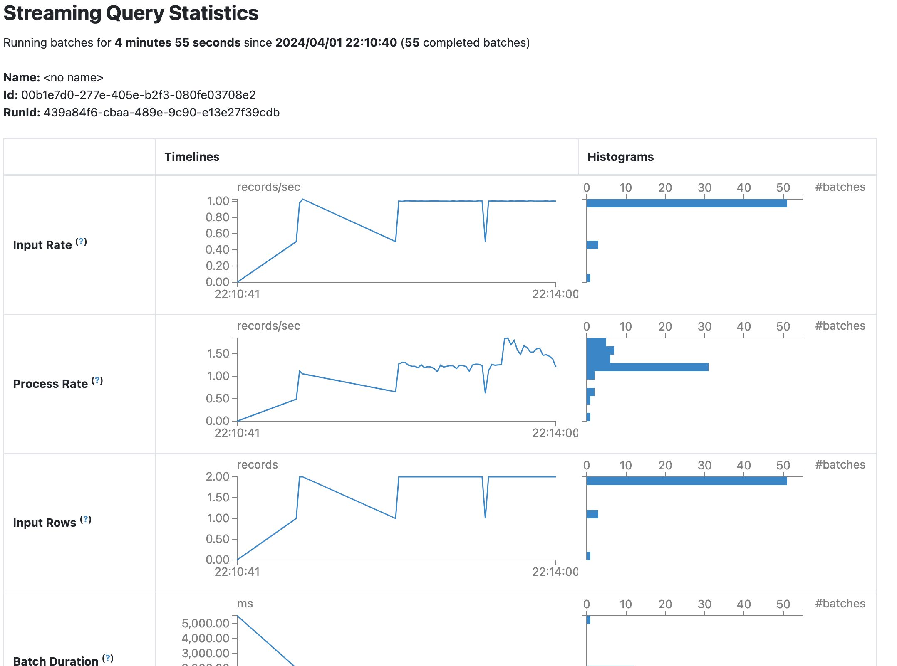

# Golang + Kafka:L "message signing"


[](https://github.com/pieteradejong/go-service/actions/workflows/go.yml)

[](https://github.com/pieteradejong/go-service/actions/workflows/go.yml)


## Project summary
Goal: Familiarize with Golang and Kafka.

### Architecture / flow:
`Message service`

1) `POST /sign` - message body -> Message Service
2) message service saves message in DB
3) Message svc puts message on Kafka topic
4) Signing service reads message from Kafka topic, signs it, and sends to separate Kafka topic
5) Message service reads signed message from Kafka, and saves message with signature to DB
6) Message service notifies user that message has been signed and saved

### Drawing

User
  |
  v
[Message Service] -- POST /sign
  |                     |
  | Saves message       | Puts message on
  | in DB               | Kafka topic
  |                     v
  |               [Kafka Topic: message-sign-request]
  |                     |
  |                     | Reads message
  |                     v
  |               [Signing Service] -- Signs message
  |                     | Sends to separate
  |                     | Kafka topic
  |                     v
  |               [Kafka Topic: message-sign-complete]
  |                     |
  | Reads signed message|
  v                     |
[Message Service]       |
  | Saves message with  |
  | signature to DB     |
  |                     |
  | Notifies user       |
  v                     |
[User] <-----------------


# Basic Run Local
Start Zookeeper and Kafka (depending your specific setup)

```bash
$ zookeeper-server-start.sh config/zookeeper.properties
$ kafka-server-start.sh config/server.properties
```


Basic Kafka commands (from `$KAFKA_HOME/bin`):

List topics:
`$ kafka-topics --list --bootstrap-server localhost:9092`

Produce from one terminal tab:
`$ kafka-console-producer --topic testtopic1 --bootstrap-server localhost:9092`

Consume from another tab:
`$ kafka-console-consumer --topic testtopic1 --bootstrap-server localhost:9092`

Run `producer/producer.go` to send a message:
`$ go run producer.go`

Test `sign-service`:
`$ curl -X GET localhost:8080/health`

Send message:
`$ curl -X POST http://localhost:8080/sign -H "Content-Type: application/json" -d '{"message": "hello to sign service"}'`

## Run Docker:
`docker-compose up`

`docker exec kafka-1 kafka-topics --create --topic topictest1 --partitions 4 --replication-factor 2 --if-not-exists --zookeeper zk1:22181,zk2:32181,zk3:42181`

## Run:
`docker-compose build --no-cache`

`docker-compose up`

`docker-compose logs sign-service`
`docker-compose logs message-service`

# Ongoing work
* [DONE] Consolidated producer, consumer, API into one Go module.
* [DONE] Create `docker-compose` for Zookeeper and Kafka Broker, run production-relevant setup locally.
* [DONE] Create single topic on Kafka Broker and produce + consume messages.
* [DONE] `POST /sign {message}` is sent to producer
* [DONE] Consumer service reads from Kafka and logs message to console
* [FIXED(*)] `docker-compose logs sign-service` -> `connection refused`
  * (*) the fix was to `docker rmi` all project docker images, and rebuild with `docker-compose up --build`
* [WIP] Implement secure data transit e.g. through SSL
* [DONE] Message send retry with exponential back-off
* [TODO] Monitoring and logging, e.g. via a web interface
* [TODO] Add config parameters to `config/kafka-config.json`
* [TODO] Unit testing 
* [DONE] Fix Docker-compose setup - hostnames and ports for ZooKeeper and Kafka
* [TODO] Add Spark Streaming that will read data from an "emoji" topic, perform some aggregation, and publish those streaming stats to another kafka topic(s).
  * DESIGN NOTE: key aspects are: **realtime** (Spark streaming window of a few seconds); data completeness is valuable but not critical (it's just emojis); **low latency** is critical; producer pattern: app users will likely send short bursts of a subset of a few distinct emojis; processing/consumption pattern: all emojis are **aggregated by frequency** sent over a several(2?)-second **time window**, and initially just logged; later, build out "clients" that subscribe to the system and via PubSub send emoji aggregations, perhaps based on proximity etc.
  * [DONE] Add `simulate requests` script to simulate POST'ing emojis/reactions. Message payload should include: `user_id`, `emoji_str`, `timestamp`, `reaction_id`.
  * [DONE] Add Spark node to setup, incl. to `docker-compose.yml`
  * [DONE] Within Spark node, add PySpark stream job, simple e.g. "count" for now
  * [DONE] Publish "count" to kafka topic
  * [TODO] Figure out what to actually do with the emoji counts
  * [TODO] Refactor `simulate_requests.py` to handle multiple clients etc.
* [OPTIONAL] Add custom `/config/kafka.cfg` for Kafka config.
* [OPTIONAL] Add custom `/config/zookeeper.cfg` for Zookeeper config.
* [TODO] for emoji application, change `Key` for Kafka message to `null` since we **don't need ordering**, and this will allow Kafka to load balance across all paritions for a topic.
* [TODO] Question: how to consume emoji reactions?
  * Idea: the point of the application is for users to share their sentiments towards the event as it happens. Two components to this:
    * Contributing: submitting their own reactions.
    * Experiencing: seeing an aggregation of the entire audience, and confirmation fo their own sensations. ("almost everyone laughed at that", "that makes some peopel also sad")
    * Important: highlgiht not only which reactions (sad, happy, laugh), but also _intensity_: LOTS of laughter, a little sadness, etc.
* [TODO] rename `sign-service` to (..?)

### Client-Server communication
* posting game reactions: `POST /reaction`
* pushing aggregated emoji reactions to [subset of] users; requirements:
  * connection is uni-directional, server is pushing aggregation updates to users
  * relevance requires that the updates be near-real-time, with a max of 2-5 seconds delay from user's app tap.
  * nature of updates is short text, only some emojis and metadata
  * overall time duration: about 60-180 minutes, the length of most sports games;
  * user base size: at least thousands, potentially tens of millions simultaneously
  * Options for implementation: 
    * Server Sent Events
      *  chosen because unidirectional, simplicity, ease of implementaiton (very little client work).
    * Web Sockets
      *  initially considered, but we only require unidirectional.
    * Short Polling
      * downside: more client work, and we don't require bidirectional.
    * Long Polling
      * downside: more client work, and we don't require bidirectional.
    * Webhooks
      * not very relevant.
    * Push Notifications
      * briefly considered, but SSE already seems perfectly suited.


### Spark Streaming Configuration choices
* Batch interval: 1 second. The user experience requires as close to realtime as posibble, and given our development setup we can handle the load for now.
* Checkpointing: enabled, and directory set, so we don't lose data.
* Backpressure: disabled, probably not needed for now.
* Windowed computations: disabled for now.
* **Overall Spark use case note**: we want to simulate thousands of users simultaneously sending emojis, and the system having to respond with near-real-time "aggregate mood of the crowd" quickly. Given this is local dev and not prod, we might have to do things differnetly and discover as we go.

**View Batch jobs in Spark UI**



Resources:
* Ideas:
    ** https://youtu.be/TAI4ZiKMcfY?si=gowvW6VeQLgH8NsY&t=589


